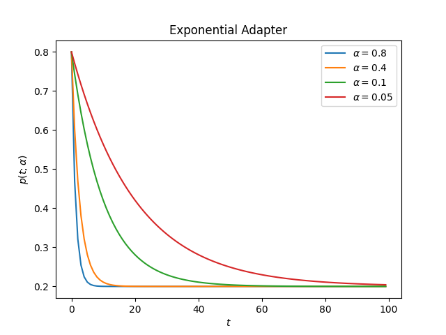
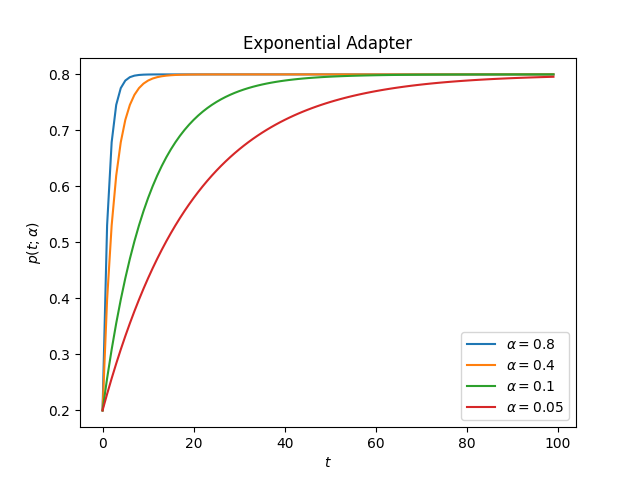
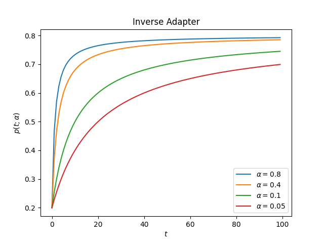
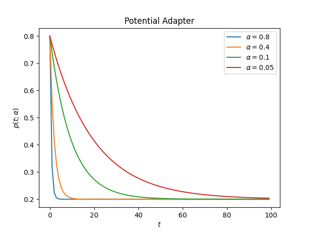
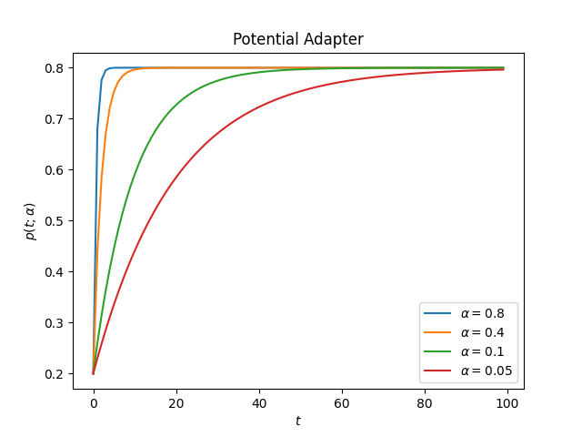
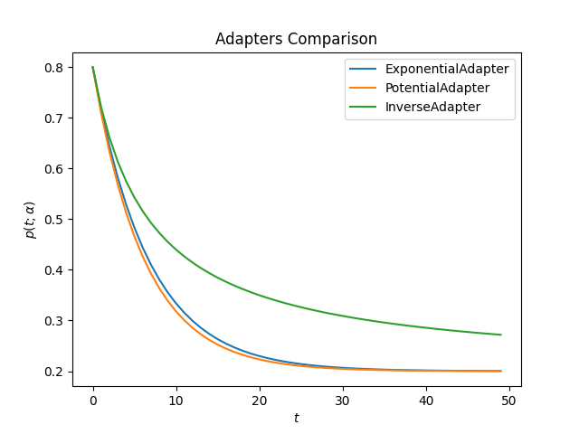

Using Adapters
==============

Introduction
------------

You can define adapters to have a dynamic mutation and crossover probabilities over the optimization
instead of a fixed value. The idea is to make these probabilities a function of the generations;
this definition can enable different training strategies, for example:

* Start with a high probability mutation to explore more diverse solutions and slowly reduce it
  to stay with the more promising ones.
* Start with a low crossover and end with a higher probability
* Combine different strategies for each parameter

All the methods uses three parameters:

* **initial_value:** This is the value used at generation 0
* **end_value:** It's the limit value that the parameter can take, starting from initial_value
* **adaptive_rate**: Controls how fast the value approaches the end_value;
  greater values increase the speed of convergence

For the following sections, it's important to understand this notation:

===================== ===============
Name                  Notation
===================== ===============
initial_value         :math:`p_0`
end_value             :math:`p_f`
current generation    :math:`t`
adaptive_rate         :math:`\alpha`
value at generation t :math:`p(t; \alpha)`
===================== ===============

Note that :math:`p_0` doesn't need to be greater than :math:`p_f`.

If :math:`p_0 > p_f`, you are performing a decay towards :math:`p_f`.

If :math:`p_0 < p_f`, you are performing an ascend towards :math:`p_f`.

All the non-constant adapters :math:`p(t; \alpha)`, for :math:`\alpha \in (0,1)`,
have the following properties:

.. math::

   \lim_{t->0^{+}} p(t; \alpha) = p_0\\
   \\
   \lim_{t->+\infty} p(t; \alpha) = p_f

The following adapters are available:

* ConstantAdapter
* ExponentialAdapter
* InverseAdapter
* PotentialAdapter

ConstantAdapter
---------------

This adapter is meant to be used internally by the package; when the user doesn't create an adapter but
instead defines the crossover or mutation probability as a real number, the package will convert it
to a `ConstantAdapter`, so the library can use the internal API with the same methods in both cases.
Because of this, its definition is:

.. math::

   p(t; \alpha) = p_0

ExponentialAdapter
------------------

The Exponential Adapter uses the following form to change the initial value

.. math::

   p(t; \alpha) = (p_0-p_f)e^{-\alpha t} + p_f

Usage example:

.. code:: python3

    from sklearn_genetic.schedules import ExponentialAdapter

    # Decay over initial_value
    adapter = ExponentialAdapter(initial_value=0.8, end_value=0.2, adaptive_rate=0.1)

    # Run a few iterations
    for _ in range(3):
        adapter.step()  # 0.8, 0.74, 0.69

This is how the adapter looks for different values of alpha

**decay:**

**ascend:**

.. code:: python3

   import matplotlib.pyplot as plt
   from sklearn_genetic.schedules import ExponentialAdapter

   values = [{"initial_value": 0.8, "end_value": 0.2},  # Decay
             {"initial_value": 0.2, "end_value": 0.8}]  # Ascend
   alphas = [0.8, 0.4, 0.1, 0.05]

   for value in values:
       for alpha in alphas:
           adapter = ExponentialAdapter(**value, adaptive_rate=alpha)
           adapter_result = [adapter.step() for _ in range(100)]

           plt.plot(adapter_result, label=r'$\alpha={}$'.format(alpha))

       plt.xlabel(r'$t$')
       plt.ylabel(r'$p(t; \alpha)$')
       plt.title("Exponential Adapter")
       plt.legend()
       plt.show()

InverseAdapter
--------------

The Inverse Adapter uses the following form to change the initial value

.. math::

   p(t; \alpha) = \frac{(p_0-p_f)}{1+\alpha t} + p_f

Usage example:

.. code:: python3

    from sklearn_genetic.schedules import InverseAdapter

    # Decay over initial_value
    adapter = InverseAdapter(initial_value=0.8, end_value=0.2, adaptive_rate=0.1)

    # Run a few iterations
    for _ in range(3):
        adapter.step()  # 0.8, 0.75, 0.7

This is how the adapter looks for different values of alpha

**decay:**

.. image:: ../images/schedules_inverse_0.png

**ascend:**

PotentialAdapter
----------------

The Inverse Adapter uses the following form to change the initial value

.. math::

   p(t; \alpha) = (p_0-p_f)(1-\alpha)^{ t} + p_f

Usage example:

.. code:: python3

    from sklearn_genetic.schedules import PotentialAdapter

    # Decay over initial_value
    adapter = PotentialAdapter(initial_value=0.8, end_value=0.2, adaptive_rate=0.1)

    # Run a few iterations
    for _ in range(3):
        adapter.step()  # 0.8, 0.26, 0.206

This is how the adapter looks for different values of alpha

**decay:**

**ascend:**

Compare
-------

This is how all adapters looks like for the same value of alpha

**decay:**

**ascend:**

.. code:: python3

   import matplotlib.pyplot as plt
   from sklearn_genetic.schedules import ExponentialAdapter, PotentialAdapter, InverseAdapter

   params = {"initial_value": 0.2, "end_value": 0.8, "adaptive_rate": 0.15}  # Ascend
   adapters = [ExponentialAdapter(**params), PotentialAdapter(**params), InverseAdapter(**params)]

   for adapter in adapters:
       adapter_result = [adapter.step() for _ in range(50)]

       plt.plot(adapter_result, label=f"{type(adapter).__name__}")

   plt.xlabel(r'$t$')
   plt.ylabel(r'$p(t; \alpha)$')
   plt.title("Adapters Comparison")
   plt.legend()
   plt.show()

Full Example
------------

In this example, we want to create a decay strategy for the mutation probability,
and an ascend strategy for the crossover probability,
lets call them :math:`p_{mt}(t; \alpha)` and :math:`p_{cr}(t; \alpha)` respectively;
this will enable the optimizer to explore more diverse solutions in the first iterations.
Take into account that on this scenario, we must be careful on choosing :math:`\alpha, p_0, p_f`,
this is because the evolutionary implementation requires that:

.. math::

   p_{mt}(t; \alpha) + p_{cr}(t; \alpha) <= 1;  \forall t

The same idea can be used for hypeparameter tuning or feature selection.

.. code-block:: python

   from sklearn_genetic import GASearchCV
   from sklearn_genetic import ExponentialAdapter
   from sklearn_genetic.space import Continuous, Categorical, Integer
   from sklearn.ensemble import RandomForestClassifier
   from sklearn.model_selection import train_test_split, StratifiedKFold
   from sklearn.datasets import load_digits
   from sklearn.metrics import accuracy_score

   data = load_digits()
   n_samples = len(data.images)
   X = data.images.reshape((n_samples, -1))
   y = data['target']
   X_train, X_test, y_train, y_test = train_test_split(X, y, test_size=0.33, random_state=42)

   clf = RandomForestClassifier()

   mutation_adapter = ExponentialAdapter(initial_value=0.8, end_value=0.2, adaptive_rate=0.1)
   crossover_adapter = ExponentialAdapter(initial_value=0.2, end_value=0.8, adaptive_rate=0.1)

   param_grid = {'min_weight_fraction_leaf': Continuous(0.01, 0.5, distribution='log-uniform'),
                 'bootstrap': Categorical([True, False]),
                 'max_depth': Integer(2, 30),
                 'max_leaf_nodes': Integer(2, 35),
                 'n_estimators': Integer(100, 300)}

   cv = StratifiedKFold(n_splits=3, shuffle=True)

   evolved_estimator = GASearchCV(estimator=clf,
                                  cv=cv,
                                  scoring='accuracy',
                                  population_size=20,
                                  generations=25,
                                  mutation_probability=mutation_adapter,
                                  crossover_probability=crossover_adapter,
                                  param_grid=param_grid,
                                  n_jobs=-1)

   # Train and optimize the estimator
   evolved_estimator.fit(X_train, y_train)
   # Best parameters found
   print(evolved_estimator.best_params_)
   # Use the model fitted with the best parameters
   y_predict_ga = evolved_estimator.predict(X_test)
   print(accuracy_score(y_test, y_predict_ga))

   # Saved metadata for further analysis
   print("Stats achieved in each generation: ", evolved_estimator.history)
   print("Best k solutions: ", evolved_estimator.hof)

