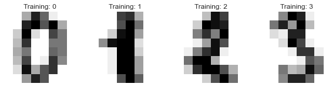
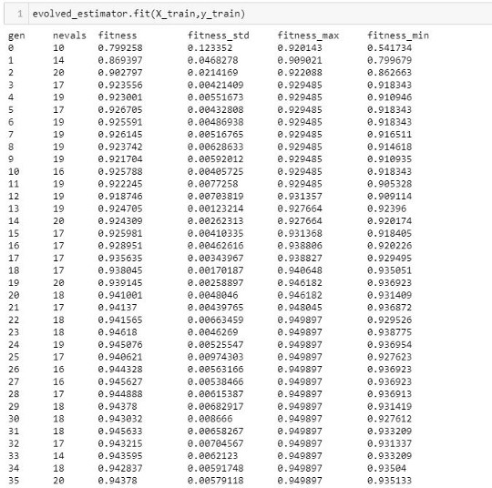
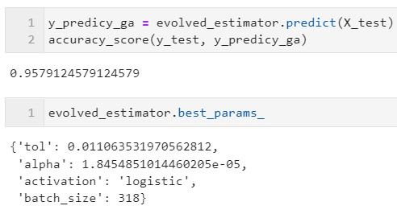
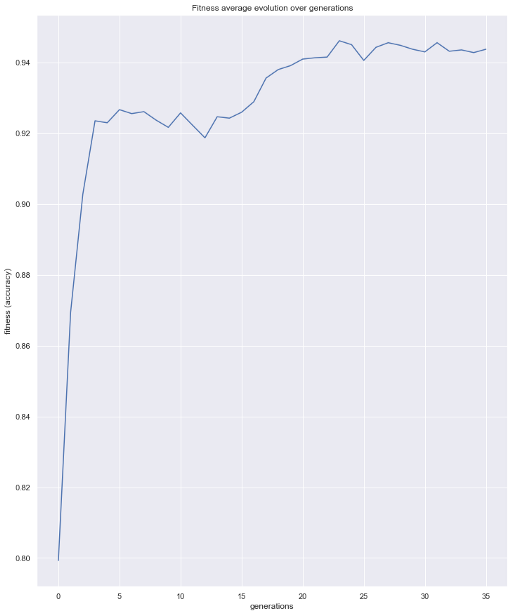
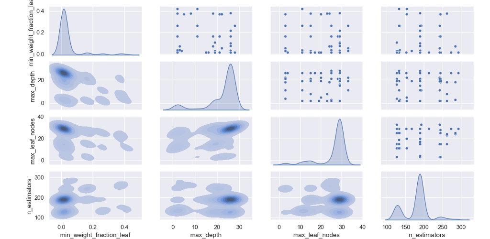

.. _basic-usage:

How to Use Sklearn-genetic-opt
==============================

Introduction
------------

Sklearn-genetic-opt uses evolutionary algorithms to fine-tune scikit-learn machine learning algorithms.
It is designed to accept a `scikit-learn <http://scikit-learn.org/stable/index.html>`__
regression or classification model (or a pipeline containing on of those).

The idea behind this package is to define the set of hyperparameters we want to tune and what are their
lower and uppers bounds on the values they can take.
It is possible to define different optimization algorithms, callbacks and build-in parameters to control how
the optimization is taken.
To get started, we'll use only the most basic features and options.

The optimization is made by evolutionary algorithms with the help of the
`deap package <https://deap.readthedocs.io/en/master/>`__.
It works by defining the set of hyperparameters to tune, it starts with a randomly sampled set of options (population).
Then by using evolutionary operators as the mating, mutation, selection and evaluation,
it generates new candidates looking to improve the cross-validation score in each generation.
It'll continue with this process until a number of generations is reached or until a callback criteria is met.

Example
-------

First lets import some dataset and others scikit-learn standard modules, we'll use the `digits dataset <https://scikit-learn.org/stable/modules/generated/sklearn.datasets.load_digits.html>`__.
This is a classification problem, we'll fine-tune a Random Forest Classifier for this task.

.. code:: python3

    import matplotlib.pyplot as plt
    from sklearn_genetic import GASearchCV
    from sklearn_genetic.space import Categorical, Integer, Continuous
    from sklearn.model_selection import train_test_split, StratifiedKFold
    from sklearn.ensemble import RandomForestClassifier
    from sklearn.datasets import load_digits
    from sklearn.metrics import accuracy_score

Lets first read the data, split it in our training and test set and visualize some of the data points:

.. code:: python3

   data = load_digits()
   n_samples = len(data.images)
   X = data.images.reshape((n_samples, -1))
   y = data['target']
   X_train, X_test, y_train, y_test = train_test_split(X, y, test_size=0.33, random_state=42)

   _, axes = plt.subplots(nrows=1, ncols=4, figsize=(10, 3))
   for ax, image, label in zip(axes, data.images, data.target):
       ax.set_axis_off()
       ax.imshow(image, cmap=plt.cm.gray_r, interpolation='nearest')
       ax.set_title('Training: %i' % label)

We should see something like this:

Now, we must define our param_grid, similar to scikit-learn, is a dictionary with the models hyperparameters.
The main difference with for example sckit-learn's GridSearchCv,
is that we don't pre-define the values to use in the search,
but rather, the boundaries of each parameter.

So if we have a parameter named *'n_estimators'* we'll only tell to sckit-learn-genetic-opt, that is an integer value,
and that we want to set a lower boundary of 100 and an upper boundary of 500, so the optimizer will set a value in this range.
We must do this with all the hyperparameters we want to tune, like this:

.. code:: python3

    param_grid = {'min_weight_fraction_leaf': Continuous(0.01, 0.5, distribution='log-uniform'),
                  'bootstrap': Categorical([True, False]),
                  'max_depth': Integer(2, 30),
                  'max_leaf_nodes': Integer(2, 35),
                  'n_estimators': Integer(100, 300)}

Notice that in the case of *'boostrap'*, as it is a categorical variable, we do must define all its possible values.
As well, in the 'min_weight_fraction_leaf', we used an additional parameter named distribution,
this is useful to tell the optimizer from which data distribution it can sample some random values during the optimization.

Now, we are ready to set the GASearchCV, its the object that will allow us to run the fitting process using evolutionary algorihtms
It has several options that we can use, for this first example, we'll keep it very simple:

.. code:: python3

    # The base classifier to tune
    clf = RandomForestClassifier()

    # Our cross-validation strategy (optional)
    cv = StratifiedKFold(n_splits=3, shuffle=True)

    # The main class from sklearn-genetic-opt
    evolved_estimator = GASearchCV(estimator=clf,
                                  cv=cv,
                                  scoring='accuracy',
                                  param_grid=param_grid,
                                  n_jobs=-1,
                                  verbose=True)

So now the setup in ready, note that are others parameters that can be specified in GASearchCV,
the ones we used, are equivalents to the meaning in scikit-learn, besides the one already explained,
is worth to mention that the "metric" is going to be used as the optimization variable,
so the algorithm will try to find the set of parameters that maximizes this metric.

We are ready to run the optimization routine:

.. code:: python3

    # Train and optimize the estimator
   evolved_estimator.fit(X_train, y_train)

During the training process, you should see a log like this:

This log, shows us the metrics obtained in each iteration (generation), this is what each entry means:

* **gen:** The number of the generation
* **nevals:** How many hyperparameters were fitted in this generation
* **fitness:** The average score metric in the cross-validation (validation set).
  In this case, the average accuracy across the folds of all the hyperparameters sets.
* **fitness_std** The standard deviation of the cross-validations accuracy.
* **fitness_max** The maximum individual score of all the models in this generation.
* **fitness_min** The minimum individual score of all the models in this generation.

After fitting the model, we have some extra methos to use the model right away.
It will use by default the best set of hyperparameters it found, based in the cross-validation score:

.. code:: python3

    # Best parameters found
    print(evolved_estimator.best_params_)
    # Use the model fitted with the best parameters
    y_predict_ga = evolved_estimator.predict(X_test)
    print(accuracy_score(y_test, y_predict_ga))

In this case, we got an accuracy score in the test set of 0.93

Now lets use a couple more functions available in the package
The first one, will help us to see the evolution of our metric over the generations

.. code:: python3

    from sklearn_genetic.plots import plot_fitness_evolution
    plot_fitness_evolution(evolved_estimator)
    plt.show()

At last, we can check the property called ``evolved_estimator.logbook``,
this is a deap's logbook which stores all the results of every individual fitted model.
sklearn-genetic-opt comes with a plot function to analize this log:

.. code:: python3

    from sklearn_genetic.plots import plot_search_space
    plot_search_space(evolved_estimator, features=['min_weight_fraction_leaf', 'max_depth', 'max_leaf_nodes', 'n_estimators'])
    plt.show()

What this plot shows us, is the distribution of the sampled values for each hyperparameter.
We can see for example in the *'min_weight_fraction_leaf'* that the algorithm mostly sampled values bellow 0.15.
You can also check every single combination of variables and the contour plot that represents the sampled values.

This concludes our introduction to the basic sklearn-genetic-opt usage.
Further tutorials will cover the GASearchCV parameters, callbacks,
different optimization algorithms and more advanced usage.