.. _basic-usage:

How to Use sklearn-genetic-opt
==============================

Introduction
------------

sklearn-genetic-opt uses evolutionary algorithms to tune scikit-learn
estimators and select informative features. It works with classification and
regression estimators, including estimators inside a scikit-learn
``Pipeline``.

The package follows the familiar scikit-learn search API, but the search space
is defined differently from :class:`~sklearn.model_selection.GridSearchCV`.
Instead of listing every candidate value, you define the allowed range or
choices for each hyperparameter. The optimizer samples candidates from that
space, evaluates them with cross-validation, and uses evolutionary operators to
produce new candidates over several generations.

Internally, sklearn-genetic-opt uses the
`DEAP package <https://deap.readthedocs.io/en/master/>`__. A population is a
set of candidate solutions. Each candidate is evaluated, selected, crossed over,
or mutated to create the next generation. The process continues until the
configured number of generations is reached or a callback stops the search.

This tutorial covers the two most common workflows:

- Hyperparameter tuning with :class:`~sklearn_genetic.GASearchCV`.
- Feature selection with :class:`~sklearn_genetic.GAFeatureSelectionCV`.

Hyperparameter Tuning
---------------------

For the first example, we will tune an
:class:`~sklearn.neural_network.MLPClassifier` on the
`digits dataset <https://scikit-learn.org/stable/modules/generated/sklearn.datasets.load_digits.html>`__.
The digits dataset is a multi-class classification problem.

.. code:: python3

    import matplotlib.pyplot as plt
    from sklearn.datasets import load_digits
    from sklearn.metrics import accuracy_score
    from sklearn.model_selection import StratifiedKFold, train_test_split
    from sklearn.neural_network import MLPClassifier

    from sklearn_genetic import EvolutionConfig, GASearchCV, PopulationConfig, RuntimeConfig
    from sklearn_genetic.space import Categorical, Continuous, Integer

Load the data, split it into training and test sets, and visualize a few
examples:

.. code:: python3

   data = load_digits()
   n_samples = len(data.images)
   X = data.images.reshape((n_samples, -1))
   y = data["target"]

   X_train, X_test, y_train, y_test = train_test_split(
       X, y, test_size=0.33, random_state=42
   )

   _, axes = plt.subplots(nrows=1, ncols=4, figsize=(10, 3))
   for ax, image, label in zip(axes, data.images, data.target):
       ax.set_axis_off()
       ax.imshow(image, cmap=plt.cm.gray_r, interpolation="nearest")
       ax.set_title("Training: %i" % label)

The samples should look like this:

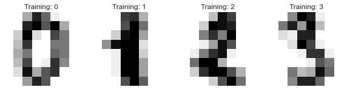

Next, define the hyperparameter search space. The keys in ``param_grid`` must
match valid estimator parameters. The values are search-space dimensions:

- :class:`~sklearn_genetic.space.Integer` samples integer values from a range.
- :class:`~sklearn_genetic.space.Continuous` samples floating-point values from
  a range.
- :class:`~sklearn_genetic.space.Categorical` samples from a fixed list of
  choices.

.. code:: python3

    param_grid = {
        "tol": Continuous(1e-2, 1e10, distribution="log-uniform"),
        "alpha": Continuous(1e-5, 2e-5),
        "activation": Categorical(["logistic", "tanh"]),
        "batch_size": Integer(300, 350),
    }

For example, ``batch_size`` can take any integer value from 300 to 350, while
``activation`` must be either ``"logistic"`` or ``"tanh"``. The
``distribution`` argument controls how random values are sampled from a
dimension. A log-uniform distribution is useful when a parameter spans several
orders of magnitude.

Now create the estimator and the cross-validation strategy:

.. code:: python3

    clf = MLPClassifier(hidden_layer_sizes=(50, 30))

    cv = StratifiedKFold(n_splits=3, shuffle=True, random_state=42)

    evolved_estimator = GASearchCV(
        estimator=clf,
        cv=cv,
        scoring="accuracy",
        param_grid=param_grid,
        evolution_config=EvolutionConfig(population_size=10, generations=20),
        population_config=PopulationConfig(initializer="smart"),
        runtime_config=RuntimeConfig(n_jobs=-1, verbose=True),
    )

Most arguments have the same meaning as in scikit-learn search estimators:
``cv`` controls the validation strategy, ``scoring`` controls the metric, and
``RuntimeConfig.n_jobs`` controls parallel execution. During the genetic search, unique
candidates in the same generation are evaluated in parallel when possible; each
candidate runs its cross-validation sequentially to avoid nested parallelism.
Set ``RuntimeConfig(parallel_backend="cv")`` to keep candidate evaluation
serial and pass ``n_jobs`` to each candidate's cross-validation instead. The
genetic-search-specific values ``EvolutionConfig.population_size`` and ``EvolutionConfig.generations``
determine how many candidate solutions are explored. By default,
``PopulationConfig(initializer="smart")`` builds a more diverse initial population
using estimator defaults, warm starts when provided, Latin hypercube samples for
numeric hyperparameters, and stratified categorical values. Set
``PopulationConfig(initializer="random")`` to use the previous random initialization
behavior. After fitting, ``fit_stats_`` reports evaluation counters such as
cache hits, duplicate candidates, cross-validation calls, and skipped invalid
feature masks.

Run the optimization:

.. code:: python3

    evolved_estimator.fit(X_train, y_train)

During training, you should see a generation-by-generation log:

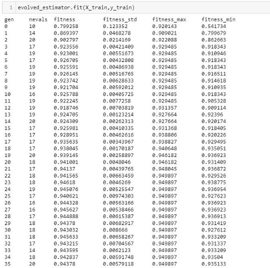

Each row summarizes one generation:

* **gen:** generation number.
* **nevals:** number of evaluated individuals in the generation.
* **fitness:** average cross-validation score for the generation.
* **fitness_std:** standard deviation of the cross-validation scores.
* **fitness_best:** best score found so far during the full search.
* **fitness_max:** best individual score in the generation.
* **fitness_min:** worst individual score in the generation.

A compact summary of diversity and optimizer state appears at the right of
each row:

* **div:** ``genotype_diversity`` — the average fraction of distinct values
  per gene position across the population. A value near 1.0 means the
  population is diverse; a value near 0.0 means it has converged to nearly
  identical configurations.
* **unique:** ``unique_individual_ratio`` — the fraction of the population
  that are distinct individuals. Values below ``diversity_threshold``
  (default 0.25) trigger diversity control.
* **stag:** ``stagnation_generations`` — how many consecutive generations
  have passed without ``fitness_best`` improving. Useful for deciding when
  to add an early-stopping callback.
* **events:** a compact summary of optimizer interventions in the generation
  — ``div`` (diversity control triggered), ``imm=N`` (N random immigrants
  injected), ``dup=N`` (N duplicates replaced), ``share`` (fitness sharing
  applied).

After fitting, inspect the full history as a DataFrame:

.. code:: python3

    import pandas as pd

    history = pd.DataFrame(evolved_estimator.history)
    print(history[[
        "gen", "fitness_best", "genotype_diversity",
        "unique_individual_ratio", "stagnation_generations",
    ]])

And check evaluation cost via ``fit_stats_``:

.. code:: python3

    print(evolved_estimator.fit_stats_)
    # evaluated_candidates: total individuals presented to the evaluator
    # unique_candidates:    distinct configurations actually cross-validated
    # cache_hits:           evaluations reused from the fitness cache
    # random_immigrants:    individuals injected when diversity control triggered
    # skipped_invalid_candidates: configs that raised exceptions during fit

After fitting, ``GASearchCV`` behaves like a fitted scikit-learn estimator. It
uses the best hyperparameters found during the search:

.. code:: python3

    print(evolved_estimator.best_params_)

    y_predict_ga = evolved_estimator.predict(X_test)
    print(accuracy_score(y_test, y_predict_ga))

In this run, the test accuracy was approximately 0.96.

.. code:: python3

    y_predict_ga = evolved_estimator.predict(X_test)
    accuracy_score(y_test, y_predict_ga)

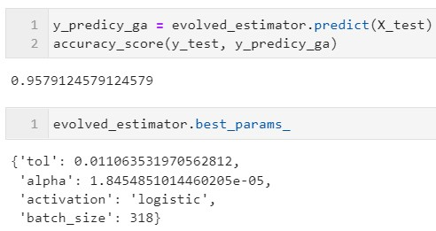

.. code:: python3

    evolved_estimator.best_params_

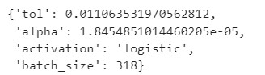

You can also inspect the optimization process. The
:func:`~sklearn_genetic.plots.plot_fitness_evolution` helper shows how the
best score found so far changed over generations:

.. code:: python3

    from sklearn_genetic.plots import plot_fitness_evolution

    plot_fitness_evolution(evolved_estimator)
    plt.show()

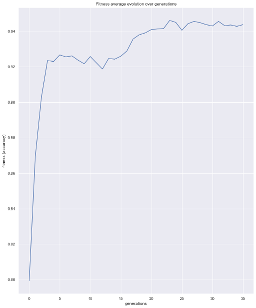

For a fuller diagnostic view, use
:func:`~sklearn_genetic.plots.plot_search_overview`. It combines convergence,
diversity and stagnation, optimizer-control decisions, and the strongest
candidate solutions in a single figure:

.. code:: python3

    from sklearn_genetic.plots import plot_search_overview

    plot_search_overview(evolved_estimator, top_k=6)
    plt.show()

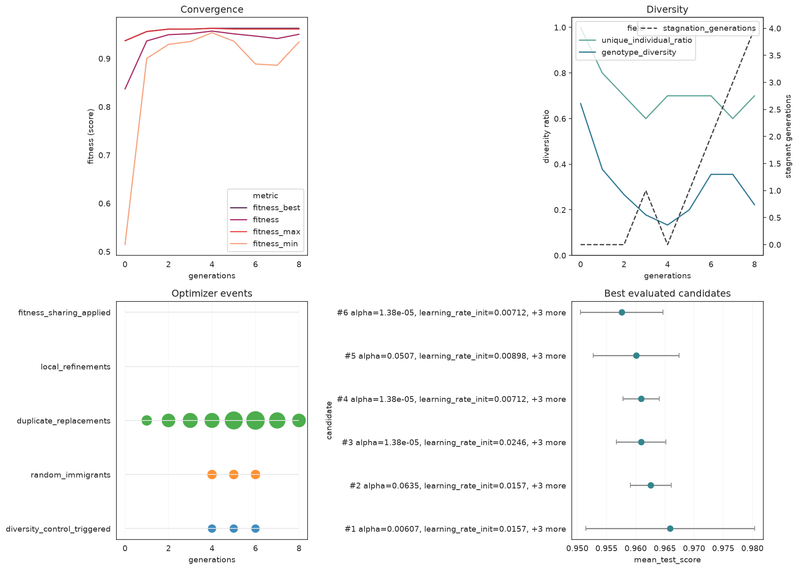

The ``evolved_estimator.logbook`` attribute stores the results generated during
the search. You can use :func:`~sklearn_genetic.plots.plot_search_space` to see
which hyperparameter values were sampled:

.. code:: python3

    from sklearn_genetic.plots import plot_search_space

    plot_search_space(evolved_estimator, features=["tol", "batch_size", "alpha"])
    plt.show()

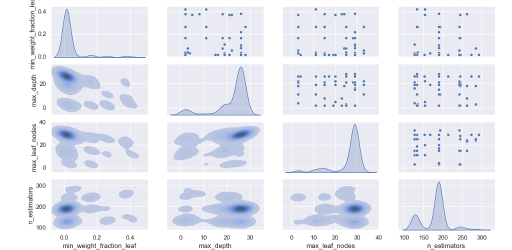

In this plot, each axis represents a sampled hyperparameter value. For example,
the ``tol`` range is intentionally broad in this tutorial, and the plot can help
you decide whether to narrow that range in a second search.

When you want to see how values changed in evaluation order, use
:func:`~sklearn_genetic.plots.plot_parameter_evolution`:

.. code:: python3

    from sklearn_genetic.plots import plot_parameter_evolution

    plot_parameter_evolution(evolved_estimator, parameters=["tol", "batch_size", "alpha"])
    plt.show()

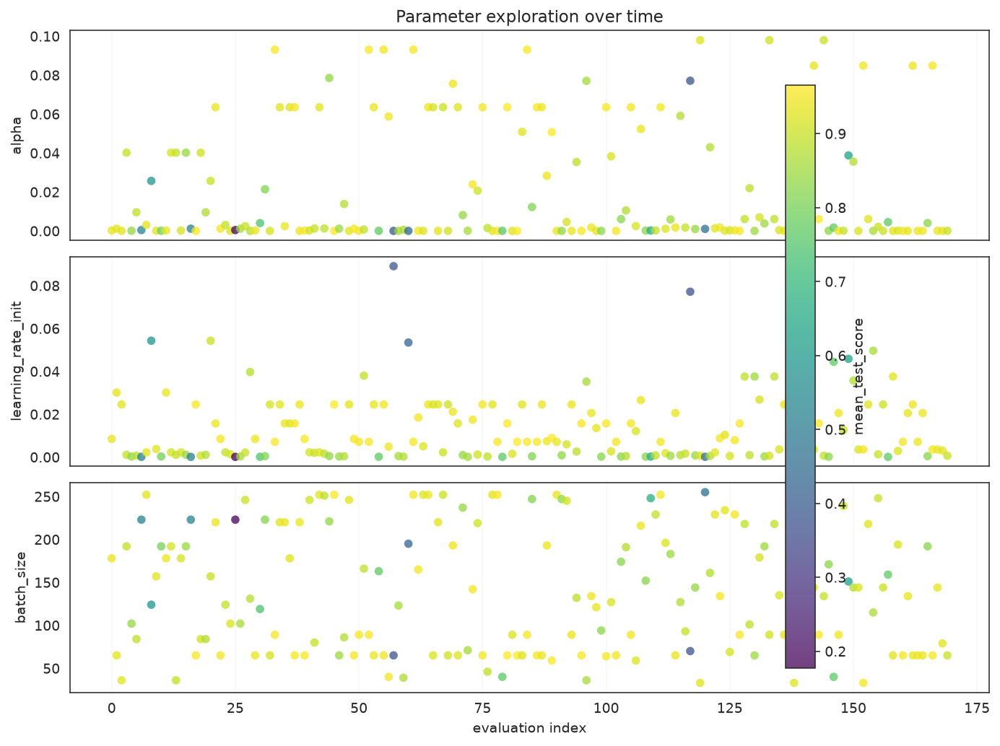

Feature Selection
-----------------

For the second example, we will use the Iris dataset and add random noise
features. The goal is to recover a useful subset of features while ignoring the
noise.

.. code:: python3

    import matplotlib.pyplot as plt
    import numpy as np
    from sklearn.datasets import load_iris
    from sklearn.metrics import accuracy_score
    from sklearn.model_selection import train_test_split
    from sklearn.svm import SVC

    from sklearn_genetic import (
        EvolutionConfig,
        GAFeatureSelectionCV,
        PopulationConfig,
        RuntimeConfig,
    )
    from sklearn_genetic.plots import plot_feature_selection, plot_fitness_evolution

    data = load_iris()
    X, y = data["data"], data["target"]

    rng = np.random.default_rng(42)
    noise = rng.uniform(0, 10, size=(X.shape[0], 10))
    X = np.hstack((X, noise))

    X_train, X_test, y_train, y_test = train_test_split(
        X, y, test_size=0.33, random_state=0
    )

The resulting dataset contains the original Iris features plus 10 noisy
features.

``GAFeatureSelectionCV`` is similar to ``GASearchCV``, but it does not optimize
hyperparameters. Instead, it evaluates subsets of columns and tries to maximize
the cross-validation score while selecting a compact feature set. The estimator
should already be configured with the hyperparameters you want to use.

.. code:: python3

    clf = SVC(gamma="auto")

    evolved_estimator = GAFeatureSelectionCV(
        estimator=clf,
        cv=3,
        scoring="accuracy",
        evolution_config=EvolutionConfig(
            population_size=30,
            generations=20,
            keep_top_k=2,
            elitism=True,
        ),
        population_config=PopulationConfig(initializer="smart"),
        runtime_config=RuntimeConfig(n_jobs=-1, verbose=True),
    )

Run the feature-selection search:

.. code:: python3

    evolved_estimator.fit(X_train, y_train)

During training, the same log format is displayed:

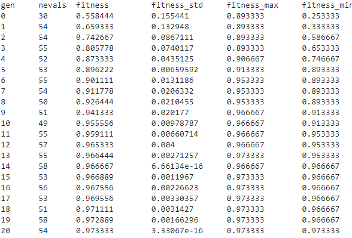

After fitting, ``GAFeatureSelectionCV`` also behaves like a scikit-learn
estimator. Prediction methods such as ``predict`` and ``predict_proba`` use only
the selected columns.

.. code:: python3

    features = evolved_estimator.support_

    y_predict_ga = evolved_estimator.predict(X_test)
    accuracy = accuracy_score(y_test, y_predict_ga)

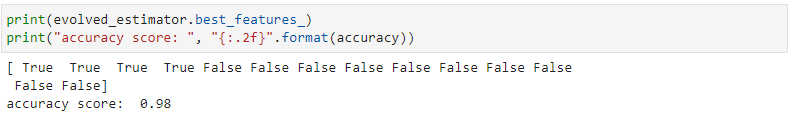

In this run, the test accuracy was approximately 0.98.

The ``support_`` attribute is a boolean mask. Each position corresponds to a
column in the input data: ``True`` means the feature was selected, and ``False``
means it was discarded. In this example, the optimizer selected the informative
Iris features and ignored the random noise features.

You can plot the fitness evolution for the feature-selection search too:

.. code:: python3

    plot_fitness_evolution(evolved_estimator)
    plt.show()

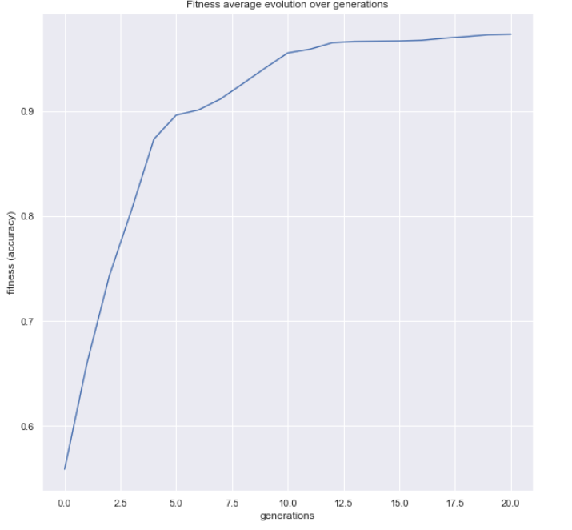

The selected support mask can also be visualized directly. Selected features
are highlighted, while rejected features remain in the background:

.. code:: python3

    feature_names = list(data.feature_names) + [f"noise_{i}" for i in range(noise.shape[1])]
    plot_feature_selection(evolved_estimator, feature_names=feature_names)
    plt.show()

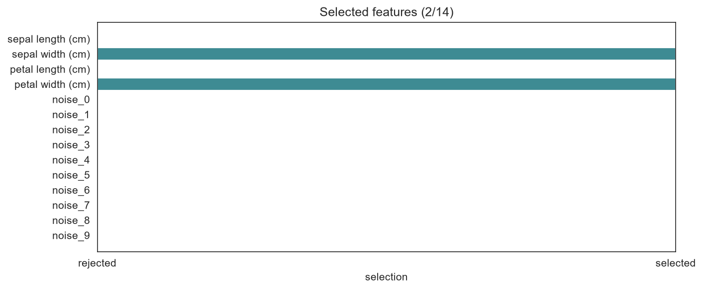

This concludes the basic sklearn-genetic-opt workflow. The next tutorials cover
callbacks, custom callbacks, schedulers, reproducibility, MLflow integration,
outlier detection, and cross-validation behavior in more detail.
