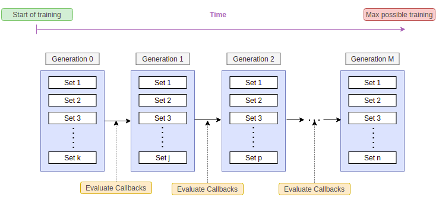
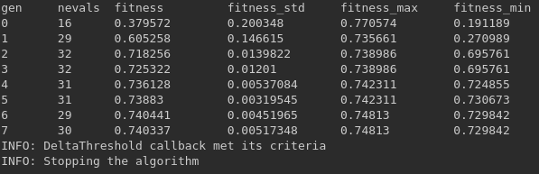
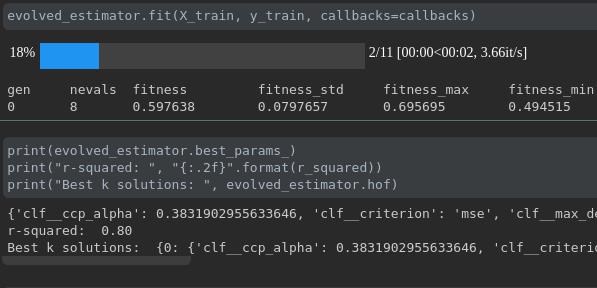
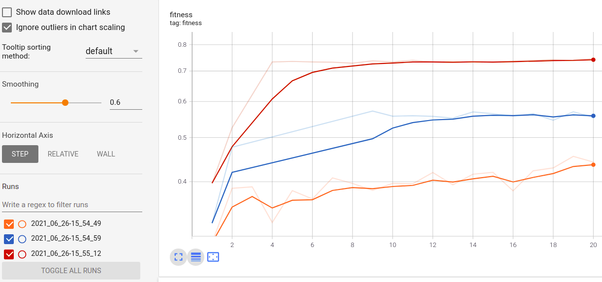

Using Callbacks
===============

Introduction
------------

Callbacks can be defined to take actions or decisions over the optimization
process while it is still running.
Common callbacks include different rules to stop the algorithm or log artifacts.
The callbacks are passed to the ``.fit`` method
of the :class:`~sklearn_genetic.GASearchCV` or :class:`~sklearn_genetic.GAFeatureSelectionCV` class.

The callbacks are evaluated at the start of the training using the `on_start` method,
at the end of each generation fit using `on_step` method and at the
end of the training using `on_end`, so it looks like this:

When a stopping callback condition is met, we should see a message
like this and the model must stop. It will keep all the information
until that training point.

Now let's see how to use them, we'll take
the data set and model used in :ref:`basic-usage`. The available callbacks are:

* ProgressBar

* ConsecutiveStopping

* DeltaThreshold

* TimerStopping

* ThresholdStopping

* TensorBoard

* LogbookSaver

ProgressBar
-----------

This callback display a tqdm bar with your training process, the length of the bar
is the max number of generations (population_size + 1) that the algorithm would run,
each step is a generation.

You can pass any ``tqdm.auto.tqdm`` valid arguments as kwargs or leave it as default.
To use this bar set:

.. code:: python3

    from sklearn_genetic.callbacks import ProgressBar
    callback = ProgressBar()

Now we just have to pass it to the estimator during the fitting

.. code:: python3

    # Already defined GASearchCV instance
    evolved_estimator.fit(X, y, callbacks=callback)

During the training it will be displayed like this:

ConsecutiveStopping
-------------------

This callback stops the optimization if the current metric value
is no greater than at least one metric from the last N generations.

It requires us to define the number of generations to compare
against the current generation and the name of the metric we want
to track.

For example, if we want to stop the optimization after 5 iterations
where the current iteration (sixth) fitness value is worst than all
the previous ones (5), we define it like this:

.. code:: python3

    from sklearn_genetic.callbacks import ConsecutiveStopping
    callback = ConsecutiveStopping(generations=5, metric='fitness')

Now we just have to pass it to the estimator during the fitting

.. code:: python3

    # Already defined GASearchCV instance
    evolved_estimator.fit(X, y, callbacks=callback)

DeltaThreshold
--------------
Stops the optimization if the absolute difference between the maximum and minimum value from the last N generations
is less or equals to a threshold.

The threshold gets evaluated after the number of generations specified is reached;
the default number is 2 (the current and previous one).

It just requires the threshold, the metric name and the generations, for example
using the 'fitness_min' value and comparing the last 5 generations:

.. code:: python3

    from sklearn_genetic.callbacks import DeltaThreshold
    callback = DeltaThreshold(threshold=0.001, generations=5, metric='fitness_min')

    evolved_estimator.fit(X, y, callbacks=callback)

TimerStopping
-------------
This callback stops the optimization if the difference in seconds between the starting time of the
first set of hyperparameters fit, and the current generation time is greater than a time threshold.

Remember that this is checked after each generation fit, so if the first (or any) generation fit takes
longer than the threshold, it won't stop the fitting process until is done with the current generation
population.

It requires the total_seconds parameters, for example stopping if the time is greater
than one minute:

.. code:: python3

    from sklearn_genetic.callbacks import TimerStopping
    callback = TimerStopping(total_seconds=60)

    evolved_estimator.fit(X, y, callbacks=callback)

ThresholdStopping
-----------------
It stops the optimization if the current metric
is greater or equals to the defined threshold.

For example, if we want to stop the optimization
if the 'fitness_max' is above 0.98:

.. code:: python3

    from sklearn_genetic.callbacks import ThresholdStopping
    callback = ThresholdStopping(threshold=0.98, metric='fitness_max')

    evolved_estimator.fit(X, y, callbacks=callback)

TensorBoard
------------
It saves at each iteration the fitness metrics into a log folder that can be
read by Tensorboard.

To use this callback you must install tensorflow first, this is not installed
within this package due it's usually a sensitive and heavy dependency::

    pip install tensorflow

It only requires defining the folder where you want to log your run, and optionally, a run_id, so
your consecutive runs don't mix up.
If the run_id is not provided, it will create a subfolder with the current date-time of your run.

.. code:: python3

    from sklearn_genetic.callbacks import TensorBoard
    callback = TensorBoard(log_dir="./logs")

    evolved_estimator.fit(X, y, callbacks=callback)

While the model is being trained you can see in real-time the metrics in Tensorboard.
If you have run more than one GASearchCV model and use the TensordBoard callback using
the same log_dir but different run_id, you can compare the metrics of each run, it looks
like this for the fitness in three different runs:

LogbookSaver
------------
It saves at each iteration the Logbook object with all the parameters and
the cv-score achieved by those parameters. It uses joblib.dump to save
the file.

.. code:: python3

    from sklearn_genetic.callbacks import LogbookSaver
    callback = LogbookSaver(checkpoint_path="./logbook.pkl")

    evolved_estimator.fit(X, y, callbacks=callback)

Then the object can be restored:

.. code:: python3

    from joblib import load

    logbook = load("/.logbook.pkl")
    print(logbook)

Define Multiple Callbacks
-------------------------

You can also specify more than one callback at the same time.
The way to define it is by passing a list of callbacks in the ``.fit`` method.

Then the estimator is going to check all the conditions in every iteration,
if at least one of the stopping callbacks conditions is met, the callback will stop the process:

.. code:: python3

    from sklearn_genetic.callbacks import ThresholdStopping, DeltaThreshold
    threshold_callback = ThresholdStopping(threshold=0.98, metric='fitness_max')
    delta_callback = DeltaThreshold(threshold=0.001, metric='fitness')

    callbacks = [threshold_callback, delta_callback]

    evolved_estimator.fit(X, y, callbacks=callbacks)

Full Example
------------
This example uses a ThresholdStopping and DeltaStopping callback
It will stop if the accuracy of the generation is above 0.98 or
if the difference between the current generation accuracy
and the last generation accuracy is not bigger than 0.001:

.. code:: python3

    from sklearn_genetic import GASearchCV
    from sklearn_genetic.space import Categorical, Integer, Continuous
    from sklearn.model_selection import train_test_split, StratifiedKFold
    from sklearn.tree import DecisionTreeClassifier
    from sklearn.datasets import load_digits
    from sklearn.metrics import accuracy_score
    from sklearn_genetic.callbacks import ThresholdStopping, DeltaThreshold

    data = load_digits()
    label_names = data['target_names']
    y = data['target']
    X = data['data']

    X_train, X_test, y_train, y_test = train_test_split(X, y, test_size=0.33, random_state=42)

    clf = DecisionTreeClassifier()

    params_grid = {'min_weight_fraction_leaf': Continuous(0, 0.5),
                   'criterion': Categorical(['gini', 'entropy']),
                   'max_depth': Integer(2, 20), 'max_leaf_nodes': Integer(2, 30)}

    cv = StratifiedKFold(n_splits=3, shuffle=True)

    threshold_callback = ThresholdStopping(threshold=0.98, metric='fitness_max')
    delta_callback = DeltaThreshold(threshold=0.001, metric='fitness')

    callbacks = [threshold_callback, delta_callback]

    evolved_estimator = GASearchCV(clf,
                                   cv=cv,
                                   scoring='accuracy',
                                   population_size=16,
                                   generations=30,
                                   tournament_size=3,
                                   elitism=True,
                                   crossover_probability=0.9,
                                   mutation_probability=0.05,
                                   param_grid=params_grid,
                                   algorithm='eaMuPlusLambda',
                                   n_jobs=-1,
                                   verbose=True)

    evolved_estimator.fit(X_train, y_train, callbacks=callbacks)
    y_predict_ga = evolved_estimator.predict(X_test)
    accuracy = accuracy_score(y_test, y_predict_ga)

    print(evolved_estimator.best_params_)
    print("accuracy score: ", "{:.2f}".format(accuracy))
