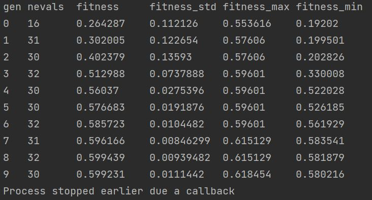

Using Callbacks
===============

Introduction
------------

Callbacks can be defined to take decisions over the optimization
process while it is still running.
Common callbacks includes different rules to stop the algorithm.

The callbacks are passed to the ``.fit`` method
of the :class:`~sklearn_genetic.GASearchCV` class.

When the callback condition is met, we should see a message
like this and the model must stop. It will keep all the information
until that training point.

Now lets see how to use them, we'll take
the data set and model used in :ref:`basic-usage`. The available callbacks are:

* ConsecutiveStopping

* DeltaThreshold

* ThresholdStopping

ConsecutiveStopping
-------------------

This callback stops the optimization if the current metric value
is no greater that at least one metric from the last N generations

It requires us to define the number of generations to compare
against the current generation and the name of the metric we want
to track.

For example, if we want to stop the optimization after 5 iterations
where the current iteration (sixth) fitness value is worst that all
the previous ones (5), we define it like this:

.. code:: python3

    from sklearn_genetic.callbacks import ConsecutiveStopping
    callback = ConsecutiveStopping(generations=5, metric='fitness')

Now we just have to pass it to the estimator during the fitting

.. code:: python3

    # Already defined GASearchCV instance
    evolved_estimator.fit(X, y, callbacks=callback)

DeltaThreshold
--------------
This callback stops the optimization if the absolute difference
between the current and last metric less or equals than a threshold.

It just requires the threshold and the metric name, for example
using the 'fitness_min' value:

.. code:: python3

    from sklearn_genetic.callbacks import DeltaThreshold
    callback = DeltaThreshold(threshold=0.001, metric='fitness')

    evolved_estimator.fit(X, y, callbacks=ConsecutiveStopping)

ThresholdStopping
-----------------
It stops the optimization if the current metric
is greater or equals than the define threshold.

For example, if we want to stop the optimization
if the 'fitness_max' is above 0.98

.. code:: python3

    from sklearn_genetic.callbacks import ThresholdStopping
    callback = ThresholdStopping(threshold=0.98, metric='fitness_max')

    evolved_estimator.fit(X, y, callbacks=ConsecutiveStopping)

Define Multiple Callbacks
-------------------------

You can also specify more than one callback at the same time.
The way to define it is by passing a list of callbacks in the ``.fit`` method.

Then the estimator is going to check all the conditions in every iteration,
if at least one of them is met, the callback will stop the process

.. code:: python3

    from sklearn_genetic.callbacks import ThresholdStopping, DeltaThreshold
    threshold_callback = ThresholdStopping(threshold=0.98, metric='fitness_max')
    delta_callback = DeltaThreshold(threshold=0.001, metric='fitness')

    callbacks = [threshold_callback, delta_callback]

    evolved_estimator.fit(X, y, callbacks=callbacks)

Full Example
------------
This example uses a ThresholdStopping and DeltaStopping callback
It will stop if the accuracy of the generation is above 0.98 or
if the difference between the current generation accuracy
and the last generation accuracy is not bigger than 0.001

.. code:: python3

    from sklearn_genetic import GASearchCV
    from sklearn_genetic.space import Categorical, Integer, Continuous
    from sklearn.model_selection import train_test_split, StratifiedKFold
    from sklearn.tree import DecisionTreeClassifier
    from sklearn.datasets import load_digits
    from sklearn.metrics import accuracy_score
    from sklearn_genetic.callbacks import ThresholdStopping, DeltaThreshold

    data = load_digits()
    label_names = data['target_names']
    y = data['target']
    X = data['data']

    X_train, X_test, y_train, y_test = train_test_split(X, y, test_size=0.33, random_state=42)

    clf = DecisionTreeClassifier()

    params_grid = {'min_weight_fraction_leaf': Continuous(0, 0.5),
                   'criterion': Categorical(['gini', 'entropy']),
                   'max_depth': Integer(2, 20), 'max_leaf_nodes': Integer(2, 30)}

    cv = StratifiedKFold(n_splits=3, shuffle=True)

    threshold_callback = ThresholdStopping(threshold=0.98, metric='fitness_max')
    delta_callback = DeltaThreshold(threshold=0.001, metric='fitness')

    callbacks = [threshold_callback, delta_callback]

    evolved_estimator = GASearchCV(clf,
                                   cv=cv,
                                   scoring='accuracy',
                                   population_size=16,
                                   generations=30,
                                   tournament_size=3,
                                   elitism=True,
                                   crossover_probability=0.9,
                                   mutation_probability=0.05,
                                   param_grid=params_grid,
                                   algorithm='eaMuPlusLambda',
                                   n_jobs=-1,
                                   verbose=True)

    evolved_estimator.fit(X_train, y_train, callbacks=callbacks)
    y_predict_ga = evolved_estimator.predict(X_test)
    accuracy = accuracy_score(y_test, y_predict_ga)

    print(evolved_estimator.best_params_)
    print("accuracy score: ", "{:.2f}".format(accuracy))
