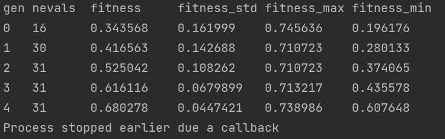

Custom Callbacks
================

sklearn-genetic-opt comes with some pre-defined callbacks,
but you can make one of your own by defining a callable with
certain methods.

The callback must be a class that implements the ``__call__`` and
``on_step`` methods, the result of them must be a bool, ``True`` means
that the optimization must stop, ``False``, means it can continue.

In this example, we are going to define a dummy callback that
stops the process if there have been more that `N` fitness values
bellow a threshold value.

The callback must have two parameters: `record` and `logbook`.
Those are a dictionary and a deap's Logbook object respectively,
with the current iteration metrics and all the past iterations metrics.
You can choice which to use, but both must be parameters
on the ``on_step`` and ``__call__`` methods.

So to check inside the logbook, we could define a function like this:

.. code-block:: python

    N=4
    metric='fitness'
    threshold=0.8

    def on_step(record, logbook, threshold):
        # Not enough data points
        if len(logbook) <= N:
            return False
        # Get the last N metrics
        stats = logbook.select(metric)[(-N - 1):]

        n_met_condition = [x for x in stats if x < threshold]

        if len(n_met_condition) > N:
            return True

        return False

As sklearn-genetic-opt expects all this logic in a single object, we must define a class
that will have all this parameters, so we can rewrite it like this:

.. code-block:: python

   class DummyThreshold:
       def __init__(self, threshold, N, metric='fitness'):
           self.threshold = threshold
           self.N = N
           self.metric = metric

       def on_step(self, record, logbook):
           # Not enough data points
           if len(logbook) <= self.N:
               return False
           # Get the last N metrics
           stats = logbook.select(self.metric)[(-self.N - 1):]

           n_met_condition = [x for x in stats if x < self.threshold]

           if len(n_met_condition) > self.N:
               return True

           return False

       def __call__(self, record, logbook):
           return self.on_step(record, logbook)

So that is it, now you can initialize the DummyThreshold
and pass it to a in the ``fit`` method of a
:class:`~sklearn_genetic.GASearchCV` instance:

.. code-block:: python

    callback = DummyThreshold(threshold=0.85, N=4, metric='fitness')
    evolved_estimator.fit(X, y, callbacks=callback)

Here there is an output example of this callback:

