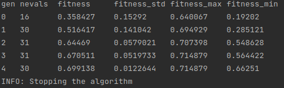

Custom Callbacks
================

sklearn-genetic-opt comes with some pre-defined callbacks,
but you can make one of your own by defining a callable with
certain methods.

Parameters
----------

The callback must be a class with inheritance from the class
:class:`~sklearn_genetic.callbacks.base.BaseCallback` that implements the
following methods:

**on_start:** This is evaluated before starting the generation 0, it should return ``None``
or ``False``. It expects the parameter `estimator`.

**on_step:** This is called at the end of each generation, the result of them must be a bool,
``True`` means that the optimization must stop, ``False``, means it can continue.
It expects the parameters `record`, `logbook` and `estimator`.

**on_end:** This method is called at the end of the las generation or after a stopping
callback meets its criteria. It expects the parameters `logbook` and `estimator`,
it should return ``None`` or ``False``.

All of those methods are optional, but at least one should be defined.

Example
-------

In this example, we are going to define a dummy callback that
stops the process if there have been more than `N` fitness values
bellow a threshold value.

The callback must have three parameters: `record`, `logbook` and `estimator`.
Those are a dictionary, a deap's Logbook object and the
current :class:`~sklearn_genetic.GASearchCV` (or :class:`~sklearn_genetic.GAFeatureSelectionCV`) respectively
with the current iteration metrics, all the past iterations metrics
and all the properties saved in the estimator.

So to check inside the logbook, we could define a function like this:

.. code-block:: python

    N=4
    metric='fitness'
    threshold=0.8

    def on_step(record, logbook, threshold, estimator=None):
        # Not enough data points
        if len(logbook) <= N:
            return False
        # Get the last N metrics
        stats = logbook.select(metric)[(-N - 1):]

        n_met_condition = [x for x in stats if x < threshold]

        if len(n_met_condition) > N:
            return True

        return False

As sklearn-genetic-opt expects all this logic in a single object, we must define a class
that will have all these parameters, so we can rewrite it like this:

.. code-block:: python

   from sklearn_genetic.callbacks.base import BaseCallback

   class DummyThreshold(BaseCallback):
       def __init__(self, threshold, N, metric='fitness'):
           self.threshold = threshold
           self.N = N
           self.metric = metric

       def on_step(self, record, logbook, estimator=None):
           # Not enough data points
           if len(logbook) <= self.N:
               return False
           # Get the last N metrics
           stats = logbook.select(self.metric)[(-self.N - 1):]

           n_met_condition = [x for x in stats if x < self.threshold]

           if len(n_met_condition) > self.N:
               return True

           return False

Now, let's expend it to add the others method, just to print a message:

.. code-block:: python

   from sklearn_genetic.callbacks.base import BaseCallback

   class DummyThreshold(BaseCallback):
       def __init__(self, threshold, N, metric='fitness'):
           self.threshold = threshold
           self.N = N
           self.metric = metric

       def on_start(self, estimator=None):
           print("This training is starting!")

       def on_step(self, record, logbook, estimator=None):
           # Not enough data points
           if len(logbook) <= self.N:
               return False
           # Get the last N metrics
           stats = logbook.select(self.metric)[(-self.N - 1):]

           n_met_condition = [x for x in stats if x < self.threshold]

           if len(n_met_condition) > self.N:
               return True

           return False

       def on_end(self, logbook=None, estimator=None):
           print("I'm done with training!")

So that is it, now you can initialize the DummyThreshold
and pass it to in the ``fit`` method of a
:class:`~sklearn_genetic.GASearchCV` instance:

.. code-block:: python

    callback = DummyThreshold(threshold=0.85, N=4, metric='fitness')
    evolved_estimator.fit(X, y, callbacks=callback)

Here there is an output example of this callback:

Notice that there is an extra INFO message, that is general for all the callbacks
that stops the training.