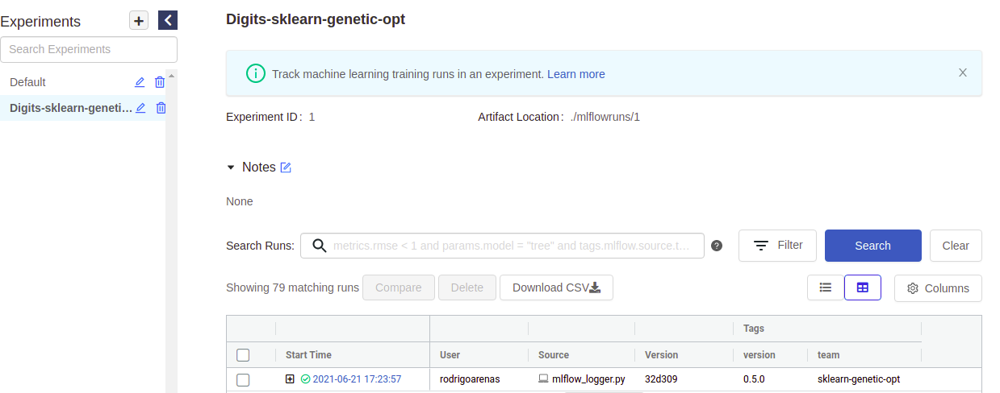
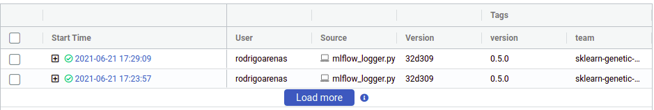
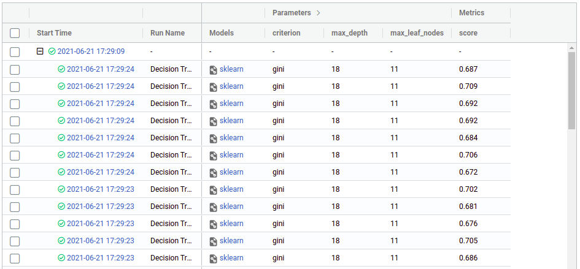
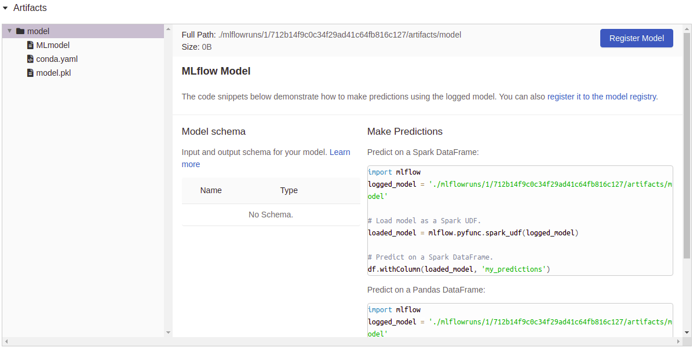

Integrating with MLflow
=======================

In this post, we are going to explain how setup the build-in integration
of sklearn-genetic-opt with MLflow.
To use this feature, we must set the parameters that will include
the tracking server, experiment name, run name, tags and others,
the full implementation is here: :class:`~sklearn_genetic.mlflow_log.MLflowConfig`

Configuration
-------------

The configuration is pretty straightforward, we just need
to import the main class and define some parameters, here there is its meaning:

* **tracking_uri:** Address of local or remote-tracking server.
* **experiment:** Case sensitive name of an experiment to be activated.
* **run_name:** Name of new run (stored as a mlflow.runName tag).
* **save_models:** If ``True``, it will log the estimator into mlflow artifacts.
* **registry_uri:** Address of local or remote model registry server.
* **tags:** Dictionary of tags to apply.

Example
--------

In this example, we are going to log the information into a mlflow server
that is running in our localhost, port 5000, we want to save each of the
trained models.

.. code:: python3

    from sklearn_genetic.mlflow_log import MLflowConfig

    mlflow_config = MLflowConfig(
        tracking_uri="http://localhost:5000",
        experiment="Digits-sklearn-genetic-opt",
        run_name="Decision Tree",
        save_models=True,
        tags={"team": "sklearn-genetic-opt", "version": "0.5.0"})

Now, this config is passed to the :class:`~sklearn_genetic.GASearchCV` class
in the parameter named `log_config`, for example:

.. code:: python3

    from sklearn_genetic import GASearchCV
    from sklearn_genetic.space import Categorical, Integer, Continuous
    from sklearn.model_selection import train_test_split, StratifiedKFold
    from sklearn.tree import DecisionTreeClassifier
    from sklearn.datasets import load_digits
    from sklearn.metrics import accuracy_score
    from sklearn_genetic.mlflow import MLflowConfig

    data = load_digits()
    label_names = data["target_names"]
    y = data["target"]
    X = data["data"]

    X_train, X_test, y_train, y_test = train_test_split(
        X, y, test_size=0.33, random_state=42)

    clf = DecisionTreeClassifier()

    params_grid = {
        "min_weight_fraction_leaf": Continuous(0, 0.5),
        "criterion": Categorical(["gini", "entropy"]),
        "max_depth": Integer(2, 20),
        "max_leaf_nodes": Integer(2, 30)}

    cv = StratifiedKFold(n_splits=3, shuffle=True)

    evolved_estimator = GASearchCV(
        clf,
        cv=cv,
        scoring="accuracy",
        population_size=3,
        generations=5,
        tournament_size=3,
        elitism=True,
        crossover_probability=0.9,
        mutation_probability=0.05,
        param_grid=params_grid,
        algorithm="eaMuPlusLambda",
        n_jobs=-1,
        verbose=True,
        log_config=mlflow_config)

    evolved_estimator.fit(X_train, y_train)
    y_predict_ga = evolved_estimator.predict(X_test)
    accuracy = accuracy_score(y_test, y_predict_ga)

    print(evolved_estimator.best_params_)

Notice that we choose small generations and population_size, just to be
able to see the results without much verbosity.

If you go to your mlflow UI and click the experiment named "Digits-sklearn-genetic-opt"
we should see something like this (I've hidden some columns to give a better look):

There we can see the user that ran the experiment, the name of the file
which contained the source code, our tags and other metadata. Notice
that there is a "plus" symbol that will show us each of our iterations,
this is because sklearn-genetic-opt will log each `GASearchCV.fit()` call
in a nested way, think it like a parent run, and each child is
one of the hyperparameters that were tested, for example, if we run the
same code again, now we see two parents run:

Now click on any of the "plus" symbols to see all the children, now they
look like this (again edited the columns to display):

From there we can see the hyperparameters and the score (cross-validation)
that we got in each run, from there we can use the regular mlflow functionalities
like comparing runs, download the CSV, register a model, etc. You can see more
on https://mlflow.org/docs/latest/index.html

Now, as we set ``save_model=True``, you can see that the column "Model"
has a file attached as an artifact, if we click on one of those, we see
a resume of that particular execution and some utils to use right away the
model:

