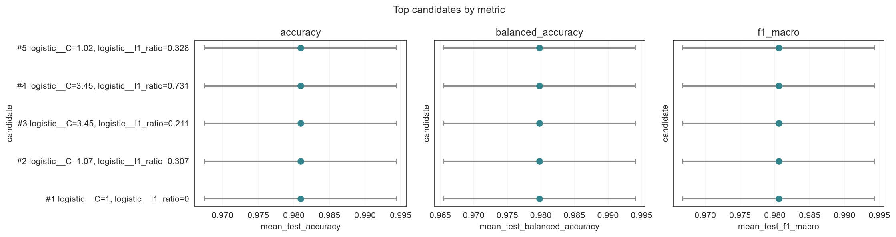

.. _multi-metric:

Multi-Metric Hyperparameter Search
====================================

``GASearchCV`` can track several metrics simultaneously while optimizing for
one. This is useful when you care about multiple properties of the model —
for example, both accuracy and class-balanced recall — but need to select a
single best configuration at the end.

How Multi-Metric Search Works
------------------------------

Pass a dictionary to ``scoring`` where each key is a metric name and each
value is a scorer string or a callable built with ``make_scorer``. Set
``refit`` to the name of the metric that should determine ``best_params_``
and refit ``best_estimator_``.

During the genetic search, candidates are ranked and selected by the
``refit`` metric only. Every metric is still evaluated at each generation
and stored in ``cv_results_``, so you can inspect tradeoffs after fitting
without rerunning the search.

.. code:: python3

    from sklearn.metrics import balanced_accuracy_score, f1_score, make_scorer

    scoring = {
        "accuracy": "accuracy",
        "balanced_accuracy": make_scorer(balanced_accuracy_score),
        "f1_macro": make_scorer(f1_score, average="macro"),
    }

Full Example
------------

This example tunes a logistic-regression pipeline on the Iris dataset,
tracking three metrics and selecting the final model by balanced accuracy.

Setup
^^^^^

.. code:: python3

    import random

    import numpy as np
    from sklearn.datasets import load_iris
    from sklearn.linear_model import LogisticRegression
    from sklearn.metrics import (
        accuracy_score,
        balanced_accuracy_score,
        f1_score,
        make_scorer,
    )
    from sklearn.model_selection import StratifiedKFold, train_test_split
    from sklearn.pipeline import Pipeline
    from sklearn.preprocessing import StandardScaler

    from sklearn_genetic import EvolutionConfig, GASearchCV, PopulationConfig, RuntimeConfig
    from sklearn_genetic.plots import plot_candidate_rankings
    from sklearn_genetic.space import Categorical, Continuous, Integer

    random.seed(42)
    np.random.seed(42)

    X, y = load_iris(return_X_y=True)
    X_train, X_test, y_train, y_test = train_test_split(
        X, y, test_size=0.3, stratify=y, random_state=42
    )

    cv = StratifiedKFold(n_splits=3, shuffle=True, random_state=42)

Define the scorers:

.. code:: python3

    scoring = {
        "accuracy": "accuracy",
        "balanced_accuracy": make_scorer(balanced_accuracy_score),
        "f1_macro": make_scorer(f1_score, average="macro"),
    }

Define the search:

.. code:: python3

    model = Pipeline([
        ("scaler", StandardScaler()),
        ("logistic", LogisticRegression(solver="saga", max_iter=1200, random_state=42)),
    ])

    param_grid = {
        "logistic__C": Continuous(1e-3, 30.0, distribution="log-uniform"),
        "logistic__l1_ratio": Continuous(0.0, 1.0),
        "logistic__class_weight": Categorical([None, "balanced"]),
        "logistic__max_iter": Integer(1000, 1500),
    }

    search = GASearchCV(
        estimator=model,
        param_grid=param_grid,
        scoring=scoring,
        refit="balanced_accuracy",   # select and refit on this metric
        cv=cv,
        evolution_config=EvolutionConfig(population_size=15, generations=12),
        population_config=PopulationConfig(
            initializer="smart",
            warm_start_configs=[{
                "logistic__C": 1.0,
                "logistic__l1_ratio": 0.0,
                "logistic__class_weight": None,
                "logistic__max_iter": 1200,
            }],
        ),
        runtime_config=RuntimeConfig(n_jobs=-1, use_cache=True),
    )

    search.fit(X_train, y_train)

After fitting, ``best_score_`` and ``best_params_`` reflect the ``refit``
metric:

.. code:: python3

    print("Refit metric:", search.refit)
    print("Best balanced-accuracy CV score:", round(search.best_score_, 4))
    print("Best parameters:", search.best_params_)

Evaluate all metrics on the holdout set:

.. code:: python3

    predictions = search.predict(X_test)

    print("Accuracy:          ", round(accuracy_score(y_test, predictions), 4))
    print("Balanced accuracy: ", round(balanced_accuracy_score(y_test, predictions), 4))
    print("F1 macro:          ", round(f1_score(y_test, predictions, average="macro"), 4))

Inspect ``cv_results_``
------------------------

For multi-metric searches ``cv_results_`` gains one set of columns per
metric: ``mean_test_<metric>``, ``std_test_<metric>``, and
``rank_test_<metric>``.

.. code:: python3

    import pandas as pd

    results = pd.DataFrame(search.cv_results_)

    metric_cols = [
        "mean_test_accuracy",
        "rank_test_accuracy",
        "mean_test_balanced_accuracy",
        "rank_test_balanced_accuracy",
        "mean_test_f1_macro",
        "rank_test_f1_macro",
    ]
    param_cols = [col for col in results.columns if col.startswith("param_")]

    print(
        results[metric_cols + param_cols]
        .sort_values("rank_test_balanced_accuracy")
        .head()
    )

Find the best configuration for each metric without rerunning the search:

.. code:: python3

    for metric in ["accuracy", "balanced_accuracy", "f1_macro"]:
        best = results.sort_values(f"rank_test_{metric}").iloc[0]
        print(f"\nBest by {metric}:")
        print(f"  score = {best[f'mean_test_{metric}']:.4f}")
        print(f"  params = {best['params']}")

This is useful when you want to compare what configuration each metric
would select after a single search run.

For advanced inspection, plot the best candidates under each metric. This
shows whether accuracy, balanced accuracy, and macro-F1 are rewarding the same
region of the search space.

.. code:: python3

    import matplotlib.pyplot as plt

    fig, axes = plt.subplots(1, 3, figsize=(15, 4), sharey=True)
    for axis, metric in zip(axes, ["accuracy", "balanced_accuracy", "f1_macro"]):
        plot_candidate_rankings(
            search,
            top_k=5,
            metric=metric,
            label_params=["logistic__C", "logistic__l1_ratio"],
            ax=axis,
            title=metric,
        )
    plt.show()

Change the Refit Metric
------------------------

``refit`` must be set before calling ``fit`` — it controls which metric the
GA optimizes during the search, not just which score is returned. If you
want a different refit metric, run the search again with a different
``refit`` value.

For a quick comparison without refitting, you can manually inspect
``cv_results_`` and build a new estimator from the best parameters for
any metric:

.. code:: python3

    from sklearn.base import clone

    # Best parameters by f1_macro, even though search refitted on balanced_accuracy
    best_row = results.sort_values("rank_test_f1_macro").iloc[0]
    alt_params = best_row["params"]

    alt_model = clone(model).set_params(**alt_params)
    alt_model.fit(X_train, y_train)
    print("F1-macro selected model accuracy:", accuracy_score(y_test, alt_model.predict(X_test)))

Practical Notes
---------------

* The ``refit`` metric is the only one used to rank candidates during the
  genetic search. The other metrics are recorded but do not influence
  selection, crossover, or mutation.
* ``best_estimator_``, ``best_params_``, and ``best_score_`` always refer
  to the ``refit`` metric.
* Use ``cv_results_`` to inspect tradeoffs after fitting. There is no
  need to rerun the search to see how different metrics would rank the
  same candidates.
* For regression, use negative scorers: ``"neg_root_mean_squared_error"``,
  ``"neg_mean_absolute_error"``. The GA maximizes by default, so these
  scorers produce correct rankings when used as the ``refit`` target.
