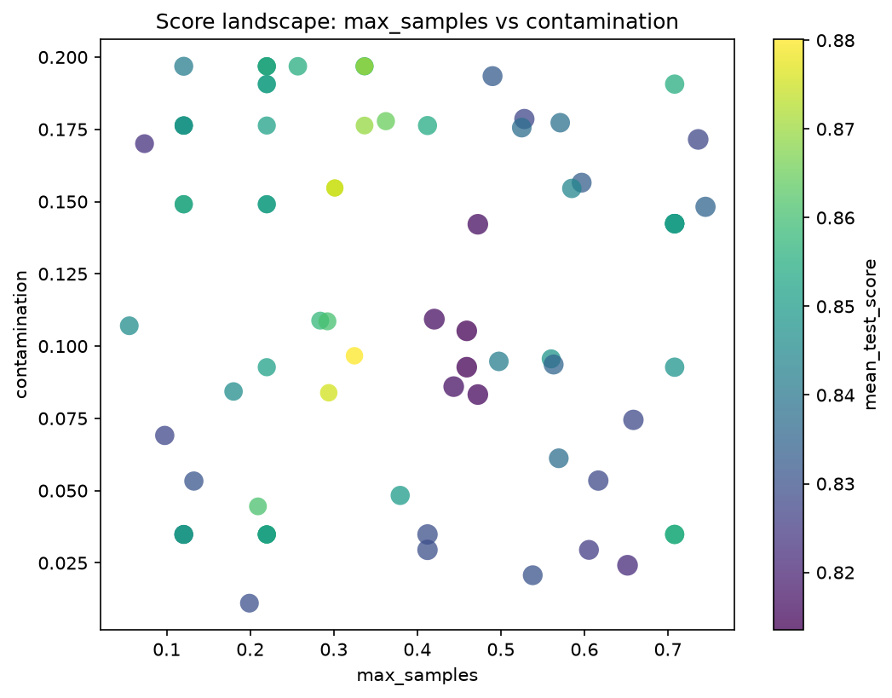
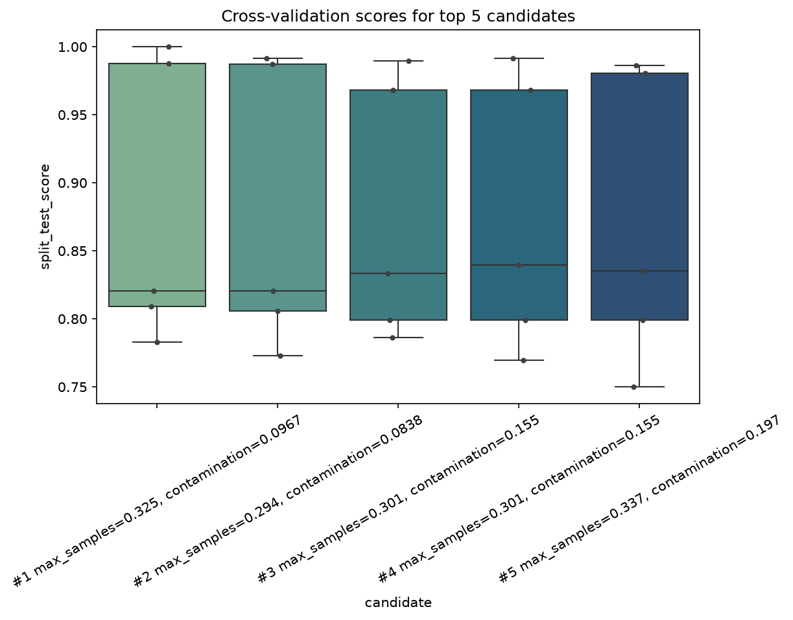

.. _outlier-detection:

Outlier Detection Support
=========================

Overview
--------

`sklearn-genetic` now includes native support for tuning outlier detection models such as
`IsolationForest`, `OneClassSVM`, and `LocalOutlierFactor` using `GASearchCV` and `GAFeatureSelectionCV`.
These models are recognized automatically, and a default scoring function is applied when
`scoring=None` is passed.

This feature simplifies hyperparameter optimization for unsupervised anomaly detection problems,
where `y` labels are not available.

Default Scoring Logic
----------------------

When `scoring=None` and an estimator is recognized as an outlier detector, a default scorer is used.
This scorer attempts the following, in order:

1. If the estimator has `score_samples`, the mean of the scores is used.
2. If `score_samples` is unavailable but `decision_function` exists, its mean value is used.
3. As a fallback, the estimator is used with `fit_predict`, and the mean of `(predictions == 1)` is returned.

This scoring system is designed to maximize flexibility and compatibility with a wide range of outlier models.

.. code-block:: python

    import numpy as np

    def default_outlier_scorer(estimator, X, y=None):
        if hasattr(estimator, 'score_samples'):
            return np.mean(estimator.score_samples(X))
        elif hasattr(estimator, 'decision_function'):
            return np.mean(estimator.decision_function(X))
        else:
            predictions = estimator.fit_predict(X)
            return np.mean(predictions == 1)

Examples
--------

Using `GASearchCV` with `IsolationForest`:

.. code-block:: python

    from sklearn.ensemble import IsolationForest
    from sklearn.metrics import roc_auc_score
    from sklearn.model_selection import StratifiedKFold, train_test_split
    from sklearn_genetic import EvolutionConfig, GASearchCV, PopulationConfig, RuntimeConfig
    from sklearn_genetic.plots import plot_cv_scores, plot_score_landscape
    from sklearn_genetic.space import Integer, Continuous
    from sklearn.datasets import make_blobs
    import matplotlib.pyplot as plt
    import numpy as np
    import random

    random.seed(42)
    np.random.seed(42)

    # Create synthetic data with outliers
    X_normal, _ = make_blobs(n_samples=475, centers=2, cluster_std=0.8, random_state=42)
    rng = np.random.default_rng(42)
    X_outliers = rng.uniform(low=-6, high=6, size=(25, 2))
    X = np.vstack([X_normal, X_outliers])
    y = np.array([0] * 475 + [1] * 25)
    X_train, X_test, y_train, y_test = train_test_split(
        X, y, test_size=0.2, stratify=y, random_state=42
    )
    cv = StratifiedKFold(n_splits=3, shuffle=True, random_state=42)

    def outlier_roc_auc(estimator, X_eval, y_eval):
        scores = -estimator.score_samples(X_eval)
        return roc_auc_score(y_eval, scores)

    estimator = IsolationForest(random_state=42)

    param_grid = {
        'contamination': Continuous(0.05, 0.3),
        'max_samples': Continuous(0.05, 0.80),
        'n_estimators': Integer(50, 150),
    }

    search = GASearchCV(estimator=estimator,
                        param_grid=param_grid,
                        scoring=outlier_roc_auc,
                        cv=cv,
                        evolution_config=EvolutionConfig(generations=4, population_size=6),
                        population_config=PopulationConfig(initializer="smart"),
                        runtime_config=RuntimeConfig(n_jobs=-1))

    search.fit(X_train, y_train)

    plot_score_landscape(search, x="max_samples", y="contamination")
    plt.show()

    plot_cv_scores(search, top_k=5, label_params=["max_samples", "contamination"])
    plt.show()

Using `GAFeatureSelectionCV` with outlier detection:

.. code-block:: python

    from sklearn_genetic import (
        EvolutionConfig,
        GAFeatureSelectionCV,
        PopulationConfig,
        RuntimeConfig,
    )
    from sklearn.ensemble import IsolationForest

    selector = GAFeatureSelectionCV(
        estimator=IsolationForest(random_state=42),
        scoring=None,  # default_outlier_scorer used
        cv=3,
        evolution_config=EvolutionConfig(generations=4, population_size=6),
        population_config=PopulationConfig(initializer="smart"),
        runtime_config=RuntimeConfig(n_jobs=-1),
    )

    selector.fit(X)

Custom Scoring
--------------

You may override the default logic by passing your own custom scoring function:

.. code-block:: python

    def custom_score(estimator, X, y=None):
        return np.std(estimator.score_samples(X))

    search = GASearchCV(
        estimator=IsolationForest(),
        param_grid=param_grid,
        scoring=custom_score,
        cv=3,
        evolution_config=EvolutionConfig(generations=4, population_size=6),
        population_config=PopulationConfig(initializer="smart"),
        runtime_config=RuntimeConfig(n_jobs=1),
    )

    search.fit(X)

Limitations
-----------

- Only estimators with `fit_predict`, `decision_function`, or `score_samples` are supported by default.
- Models not recognized as outlier detectors must be scored explicitly or will raise a `ValueError`.

