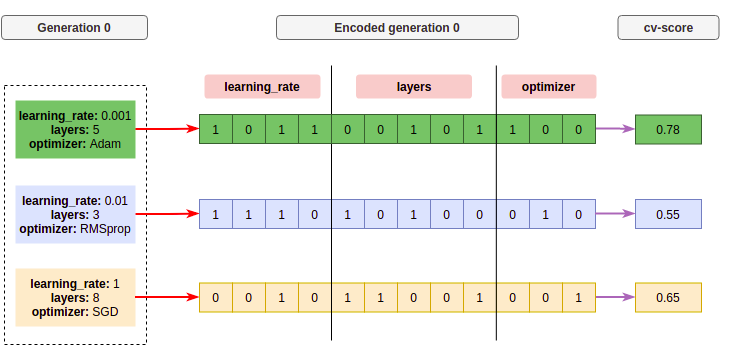
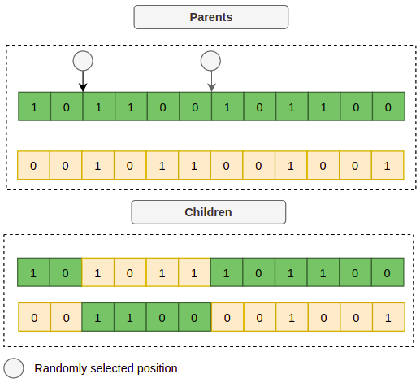
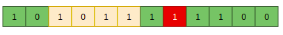
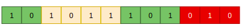
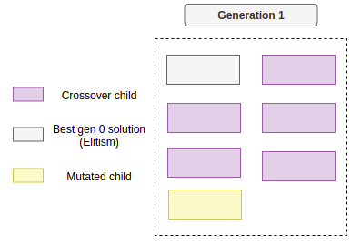
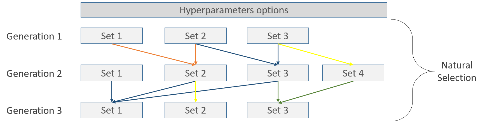
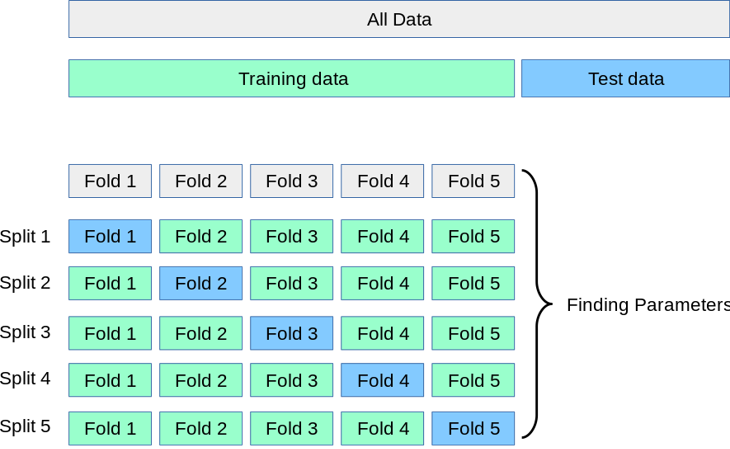

Understanding the evaluation process
====================================

In this post, we are going to explain how the evaluation process works
on hyperparameters tuning and how to use different validation strategies.

Parameters
----------

The :class:`~sklearn_genetic.GASearchCV` class, expects a parameter named `cv`.
This stands for cross-validation and it accepts any of the scikit-learn
strategies, such as K-fold, Repeated K-Fold, Stratified k-fold, and so on.
You can find more about this in `scikit-learn documentation <https://scikit-learn.org/stable/modules/cross_validation.html>`_.

A second parameter that comes along, is the `scoring`, this is the evaluation metric
that the model is going to use, to decide which model is better,
it could, for example be accuracy, precision, recall for a classification problem
or r2, max_error, neg_root_mean_squared_error for a regression problem.
To see the full list of metrics, check in `here <https://scikit-learn.org/stable/modules/model_evaluation.html>`_

Evolutionary Algorithms background
----------------------------------

The Genetic algorithm (GA) is a metaheuristic process inspired by natural selection, it's used in optimization
and search problems in general, and is usually based on a set of functions such as mutation, crossover and selection,
let's call these the genetic operators.
I'll use the following terms interchangeably in this section to make the connection between the GA and machine learning:

One choice of hyperparameters→An individual,
Population→ Several individuals,
Generation→One fixed iteration that contains a fixed population,
Fitness value→Cross-validation score.

There are several variations, but in general, the steps to follow look like this:

1. Generate a randomly sampled population (different sets of hyperparameters); this is generation 0.
2. Evaluate the fitness value of each individual in the population, in terms of machine learning,
   get the cross-validation scores.
3. Generate a new generation by using several genetic operators.
   Repeat steps 2 and 3 until a stopping criterion is met.

Let's go step by step.

**Create generation 0 and evaluate it:**

As mentioned you could generate a random set of several hyperparameters,
or you could include a few manually selected ones that you already tried and think are good candidates.

Each set gets usually encoded in form of a chromosome, a binary representation of the set,
for example, if we set the size of the first generation to be 3 individuals, it would look like this:

So in this generation, we get three individuals that are mapped to a chromosome (binary) representation,
using an encoding function represented as the red arrow, each box in the chromosome is a gen.
A fixed section of the chromosome is one of the hyperparameters.
Then we get the cross-validation score (fitness) of each candidate using a scoring function,
its shown as the purple arrow.

**Create a new generation:**

Now we can create a new set of candidates, as mentioned, there are several genetic operators,
I'm going to show the most common ones:

**Crossover:**

This operator consists of taking two parent chromosomes and mates them to create new children,
the way we select the parents could be by a probability distribution function, which gives more probability to the individuals with higher fitness of the generation, let's say the individual number 1 and 3 got selected, then we can take two random points of each parent and make the crossover, like this:

Now the children represent a new set of hyperparameters, if we decode each child we could get for example:

.. code:: bash

    Child 1: {"learning_rate": 0.015, "layers": 4, "optimizer": "Adam"}
    Child 2: {"learning_rate": 0.4, "layers": 6, "optimizer": "SGD"}

But making crossovers, over the same sets of hyperparameters might end up giving similar results after some iterations,
so we are stuck with the same kind of solutions, that is why we introduce other operations like the mutation.

**Mutation:**

This operator allows with a low enough probability (< ~0.1), to change one of the gens or a whole hyperparameter randomly, to create more diverse sets.
Let's take, for example, child 1 from the previous image, let's pick up a random gen and change its value:

Or it could even change a whole parameter, for example, the optimizer:

**Elitism:**

This selection strategy refers to the process of selecting the best individuals of each generation,
to make sure its information is propagated across the generations. This is very straightforward,
just select the best k individuals based on their fitness value and copy it to the next generation.
So after performing those operations, a new generation may look like this:

From now on, just repeat the process for several generations until a stopping criteria is met,
those could be for example:

* A maximum number of generations was reached.
* The process has run longer than the budgeted time.
* There are no performance improvements (below a threshold) from the last n generations.

Steps
-----

Now, moving to this package implementation.
The way `GASearchCV` evaluates the candidates is as follows:

* It starts by selecting random sets of hyperparameters according to the `param_grid` definition,
  the total number of sets is determined by the `population_size` parameter.

* It fits a model per each sets of hyperparameters and calculates the cross validation score
  according to the `cv` and `scoring` setup.

* After evaluating each candidate, the fitness, fitness_std, fitness_max and fitness_min are computed
  and are logged into the console if ``verbose=True``.
  `Fitness` is the way to refer to the selected metric,
  but this is calculated as the average of all the candidates of the current generation, this means that if there are
  10 different sets of hyperparameters, the `fitness` value, is the average score of those 10 evaluated candidates,
  the same goes for the other metrics.

* Now it creates new sets (generations) of hyperparameters,
  those are created by combining the last generation with different strategies, those strategies
  depends on the selected :mod:`~sklearn_genetic.algorithms`.

* It repeats steps 2, 3 and 4 until the number of generations is met, or until callbacks stop the process.

* At the end, the algorithm selects the best hyperparameters, as the set that got the best individual
  cross-validation scoring.

Those steps could be represented like this, each line represents one of several possible
natural processes like mating, crossover, selection and mutation:

Inside each set, the cross validation takes place, for example, using the 5-Folds strategy

Image is taken from `scikit-learn <https://scikit-learn.org/stable/modules/cross_validation.html>`_

Example
-------

This example is going to use a regression problem from the Boston house prices dataset.
We are going to use a K-Fold with 5 splits taking as evaluation the r-squared metric.

In the end, we are going to print the top 4 solutions and the r-squared
on the test set for the best set of hyperparameters.

.. code:: python3

    from sklearn_genetic import GASearchCV
    from sklearn_genetic.space import Integer, Categorical, Continuous
    from sklearn.datasets import load_diabetes
    from sklearn.model_selection import train_test_split, KFold
    from sklearn.tree import DecisionTreeRegressor
    from sklearn.metrics import r2_score
    from sklearn.pipeline import Pipeline
    from sklearn.preprocessing import StandardScaler

    data = load_diabetes()

    y = data["target"]
    X = data["data"]

    X_train, X_test, y_train, y_test = train_test_split(
        X, y, test_size=0.33, random_state=42)

    cv = KFold(n_splits=5, shuffle=True)

    clf = DecisionTreeRegressor()

    pipe = Pipeline([('scaler', StandardScaler()), ('clf', clf)])

    param_grid = {
        "clf__ccp_alpha": Continuous(0, 1),
        "clf__criterion": Categorical(["squared_error", "absolute_error"]),
        "clf__max_depth": Integer(2, 20),
        "clf__min_samples_split": Integer(2, 30),
    }

    evolved_estimator = GASearchCV(
        estimator=pipe,
        cv=3,
        scoring="r2",
        population_size=15,
        generations=20,
        tournament_size=3,
        elitism=True,
        keep_top_k=4,
        crossover_probability=0.9,
        mutation_probability=0.05,
        param_grid=param_grid,
        criteria="max",
        algorithm="eaMuCommaLambda",
        n_jobs=-1,
    )

    evolved_estimator.fit(X_train, y_train)
    y_predict_ga = evolved_estimator.predict(X_test)
    r_squared = r2_score(y_test, y_predict_ga)

    print(evolved_estimator.best_params_)
    print("r-squared: ", "{:.2f}".format(r_squared))
