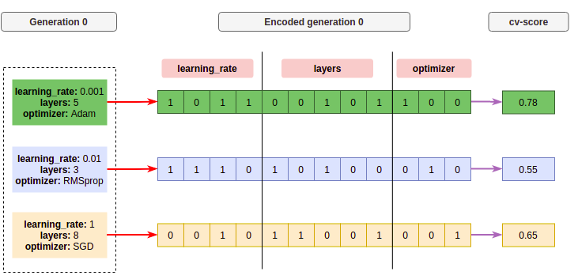
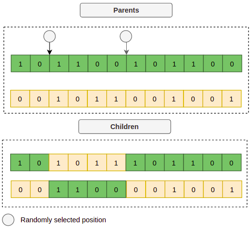
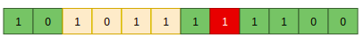
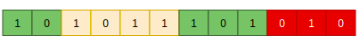
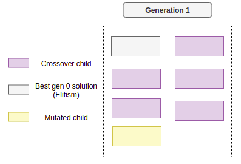
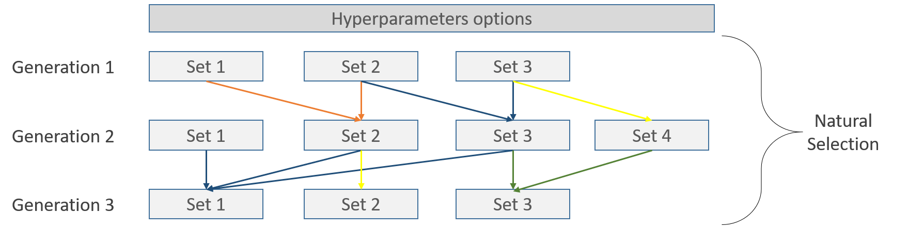
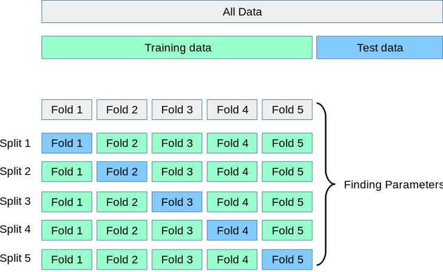

Understanding the Evaluation Process
====================================

This tutorial explains how :class:`~sklearn_genetic.GASearchCV` evaluates
candidate hyperparameters and how cross-validation fits into the evolutionary
search process.

Two parameters control most of the evaluation behavior:

``cv``
    The cross-validation strategy. This can be an integer or any compatible
    scikit-learn cross-validator, such as
    :class:`~sklearn.model_selection.KFold`,
    :class:`~sklearn.model_selection.StratifiedKFold`, or
    :class:`~sklearn.model_selection.RepeatedKFold`. See the
    `scikit-learn cross-validation documentation <https://scikit-learn.org/stable/modules/cross_validation.html>`__
    for more details.

``scoring``
    The metric used to evaluate each candidate. For classification, common
    choices include ``"accuracy"``, ``"precision"``, and ``"recall"``. For
    regression, common choices include ``"r2"``, ``"max_error"``, and
    ``"neg_root_mean_squared_error"``. The full list is available in the
    `scikit-learn model evaluation documentation <https://scikit-learn.org/stable/modules/model_evaluation.html>`__.

Evolutionary Algorithm Background
---------------------------------

A genetic algorithm is a metaheuristic optimization method inspired by natural
selection. In sklearn-genetic-opt, the algorithm searches over possible
hyperparameter configurations and uses their cross-validation scores as the
fitness signal.

The main concepts are:

- **Individual:** one candidate solution, such as one set of hyperparameters.
- **Population:** a group of individuals evaluated in the same generation.
- **Generation:** one iteration of the evolutionary process.
- **Fitness value:** the score used to compare individuals, usually a
  cross-validation score.
- **Genetic operators:** operations such as selection, crossover, mutation, and
  elitism that create the next generation.

At a high level, the process is:

1. Sample an initial population from the search space. This is generation 0.
2. Evaluate each individual with cross-validation.
3. Use genetic operators to create a new generation.
4. Repeat the evaluation and generation steps until the search reaches its
   generation limit or a callback stops it.

Creating the First Generation
-----------------------------

The first generation is usually sampled randomly from the search space defined
by ``param_grid``. You can also provide warm-start candidates when you already
know useful configurations.

Each individual can be represented as a chromosome-like structure. In the
example below, the first generation contains three individuals. Each chromosome
encodes one candidate set of hyperparameters:

The red arrow represents the encoding step, where hyperparameter values are
mapped into a chromosome representation. Each block is a gene, and groups of
genes represent hyperparameters. The purple arrow represents scoring: each
candidate is decoded, evaluated with cross-validation, and assigned a fitness
value.

Creating New Generations
------------------------

After the initial population is evaluated, the algorithm creates a new
generation. The exact process depends on the selected
:mod:`~sklearn_genetic.algorithms` strategy, but the most common operations are
crossover, mutation, selection, and elitism.

Crossover
^^^^^^^^^

Crossover combines information from two parent chromosomes to create new
children. Parent selection usually favors individuals with better fitness, so
stronger candidates have a higher chance of contributing to the next generation.

For example, if individuals 1 and 3 are selected as parents, the algorithm can
split their chromosomes and exchange sections:

After decoding the child chromosomes, the resulting candidates might look like
this:

.. code:: bash

    Child 1: {"learning_rate": 0.015, "layers": 4, "optimizer": "Adam"}
    Child 2: {"learning_rate": 0.4, "layers": 6, "optimizer": "SGD"}

Mutation
^^^^^^^^

Crossover alone can make the search converge too quickly around similar
solutions. Mutation introduces diversity by randomly changing part of a
chromosome. It can alter a single gene or an entire hyperparameter value.

For example, a single gene in a child chromosome can change:

Or the mutation can change a complete hyperparameter, such as the optimizer:

Elitism
^^^^^^^

Elitism keeps the best individuals from one generation and copies them into the
next generation. This helps preserve strong candidates while the rest of the
population continues exploring.

After crossover, mutation, selection, and elitism, a new generation may look
like this:

The search repeats this cycle until one of the stopping conditions is met:

- The maximum number of generations is reached.
- The search exceeds a time budget.
- An early-stopping callback detects that the score has reached a threshold or
  stopped improving.

How GASearchCV Evaluates Candidates
-----------------------------------

In sklearn-genetic-opt, :class:`~sklearn_genetic.GASearchCV` evaluates
candidate hyperparameters as follows:

1. Sample ``population_size`` candidate configurations from ``param_grid``.
2. Fit and score one estimator for each candidate using the configured ``cv``
   and ``scoring`` values.
3. Log generation-level metrics when ``verbose=True``.
4. Create the next generation using the selected evolutionary algorithm.
5. Repeat until ``generations`` is reached or callbacks stop the search.
6. Select the best hyperparameters based on the best individual
   cross-validation score.

If ``use_cache=True`` (the default), candidates that have already been evaluated
reuse their stored fitness values. Duplicate candidates inside the same
generation are also evaluated only once and then recorded for each occurrence.
When ``n_jobs`` enables parallel execution, unique candidates in a generation
are evaluated in parallel, while each candidate's own cross-validation runs
sequentially to avoid nested parallelism. Set ``parallel_backend="cv"`` to keep
candidate evaluation serial and pass ``n_jobs`` to each candidate's
cross-validation instead. After fitting, ``fit_stats_`` exposes counters for
actual cross-validation calls, cache hits, duplicate candidates, skipped invalid
candidates, and population-level parallel batches.

The ``history`` attribute also includes optimizer telemetry for each generation:
``population_size``, ``unique_individuals``, ``unique_individual_ratio``,
``genotype_diversity``, ``fitness_improvement``, ``fitness_improved``,
``stagnation_generations``, and ``best_generation``. These fields help diagnose
whether the search is still exploring diverse solutions or has started to
converge/stagnate around the same candidates.

The generation log contains summary metrics:

``fitness``
    The average score across the individuals in the current generation.

``fitness_std``
    The standard deviation of the individual scores in the current generation.

``fitness_max``
    The best individual score in the current generation.

``fitness_min``
    The worst individual score in the current generation.

These values summarize the population, not just the final selected model. For
example, if ``population_size=10``, the ``fitness`` value is the average score
of the 10 candidates evaluated in that generation.

The complete flow can be represented like this:

Each candidate is evaluated with cross-validation. For example, a 5-fold
strategy splits the data into five train/validation rotations:

Image taken from
`scikit-learn <https://scikit-learn.org/stable/modules/cross_validation.html>`__.

Example
-------

This example tunes a :class:`~sklearn.tree.DecisionTreeRegressor` inside a
scikit-learn :class:`~sklearn.pipeline.Pipeline` on the diabetes regression
dataset. The search uses 5-fold cross-validation and optimizes the ``"r2"``
metric.

At the end, we print the best hyperparameters and the R-squared score on the
test set.

.. code:: python3

    from sklearn.datasets import load_diabetes
    from sklearn.metrics import r2_score
    from sklearn.model_selection import KFold, train_test_split
    from sklearn.pipeline import Pipeline
    from sklearn.preprocessing import StandardScaler
    from sklearn.tree import DecisionTreeRegressor

    from sklearn_genetic import GASearchCV
    from sklearn_genetic.space import Categorical, Continuous, Integer

    data = load_diabetes()
    X, y = data["data"], data["target"]

    X_train, X_test, y_train, y_test = train_test_split(
        X, y, test_size=0.33, random_state=42
    )

    cv = KFold(n_splits=5, shuffle=True, random_state=42)

    pipe = Pipeline(
        [
            ("scaler", StandardScaler()),
            ("clf", DecisionTreeRegressor(random_state=42)),
        ]
    )

    param_grid = {
        "clf__ccp_alpha": Continuous(0, 1),
        "clf__criterion": Categorical(["squared_error", "absolute_error"]),
        "clf__max_depth": Integer(2, 20),
        "clf__min_samples_split": Integer(2, 30),
    }

    evolved_estimator = GASearchCV(
        estimator=pipe,
        cv=cv,
        scoring="r2",
        population_size=15,
        generations=20,
        tournament_size=3,
        elitism=True,
        keep_top_k=4,
        crossover_probability=0.9,
        mutation_probability=0.05,
        param_grid=param_grid,
        criteria="max",
        algorithm="eaMuCommaLambda",
        n_jobs=-1,
    )

    evolved_estimator.fit(X_train, y_train)

    y_predict_ga = evolved_estimator.predict(X_test)
    r_squared = r2_score(y_test, y_predict_ga)

    print(evolved_estimator.best_params_)
    print("R-squared:", "{:.2f}".format(r_squared))
